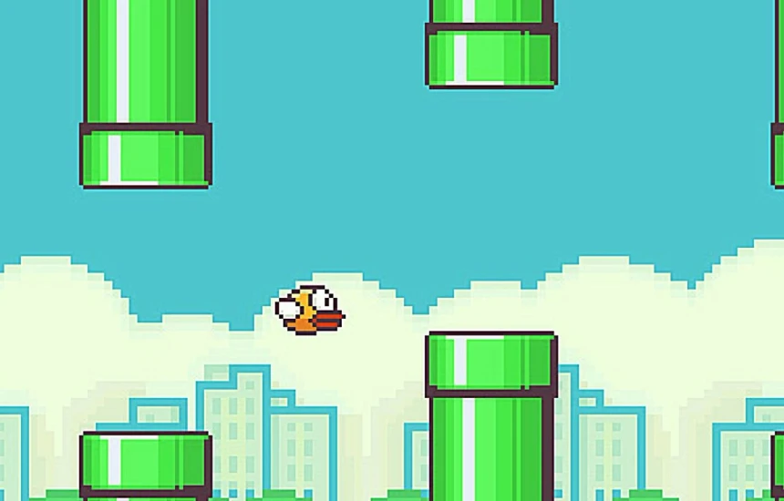

# Flappy Birds
Este proyecto es una implementación del popular juego Flappy Birds. En este juego, el jugador controla un pájaro que intenta volar entre columnas de tubos verdes sin chocar con ellos. El objetivo es pasar la mayor cantidad de tubos posibles sin colisionar.



- **Flappy Bird** es un videojuego de arcade.
- Es un juego de desplazamiento lateral en 2D.
- **Fue creado por Dong Nguyen**, un desarrollador de videojuegos independiente de Vietnam.
- **Se lanzó en mayo de 2013**, pero ganó gran popularidad a principios de 2014.
- Dong Nguyen desarrolló el juego bajo su empresa **.Gears Studio**.
- El juego fue desarrollado utilizando **Corona SDK**, un kit de desarrollo de software para crear aplicaciones móviles.
- **El objetivo del juego** es simple: el jugador controla a un pájaro que intenta volar entre columnas de tubos verdes sin chocar con ellos.
- **El objetivo del juego** es simple: el jugador controla a un pájaro que intenta volar entre columnas de tubos verdes sin chocar con ellos.
- **La mecánica de juego** se basa en un solo control: tocar la pantalla para que el pájaro aletee y se mantenga en el aire.
- El diseño gráfico del juego es retro y está inspirado en los juegos de 8 bits.
- Flappy Bird fue retirado de las tiendas de aplicaciones en **febrero de 2014** por su propio creador, Dong Nguyen, debido a la abrumadora popularidad y la presión mediática.
- A pesar de su simplicidad, el juego es notoriamente difícil y adictivo.
- Flappy Bird generó ingresos significativos a través de publicidad dentro del juego.
- **Sitio oficial del creador**: [Dong Nguyen en Twitter](https://twitter.com/dongatory)

## 1. Tecnologías Utilizadas para Nuestro Flappy Birds

Para realizar nuestro propio proyecto de Flappy Birds, utilizamos las siguientes tecnologías:

- **Lenguaje de Programación**: Python
  - Utilizamos Python debido a su simplicidad y facilidad de uso, lo que permite un desarrollo rápido y eficiente. Además, Python ofrece una excelente gestión de imágenes y gráficos, lo que es crucial para un juego como Flappy Birds. La comunidad y el soporte de Python son extensos, proporcionando numerosos recursos y librerías adicionales que pueden facilitar el desarrollo de juegos.

- **Librería**: `import pygame`
  - Pygame es una biblioteca de código abierto diseñada para crear videojuegos. Nos ayuda a crear juegos y programas multimedia completamente funcionales en Python. Para utilizar `pygame`, sigue estos pasos:
    1. **Instalar la librería**:
        ```sh
        pip install pygame
        ```
    2. **Inicializar `pygame` en tu script**:
        ```python
        import pygame
        pygame.init()
        ```
    3. **Crear una ventana de juego**:
        ```python
        screen = pygame.display.set_mode((ancho, alto))
        ```
    4. **Controlar el bucle del juego**:
        ```python
        running = True
        while running:
            for event in pygame.event.get():
                if event.type == pygame.QUIT:
                    running = False
        pygame.quit()
        ```
    5. **Actualizar la pantalla**:
        ```python
        pygame.display.flip()
        ```
## 2. Forma en que se Estructuró Nuestro Juego de Flappy Birds
### 2.1 Proceso de Desarrollo


